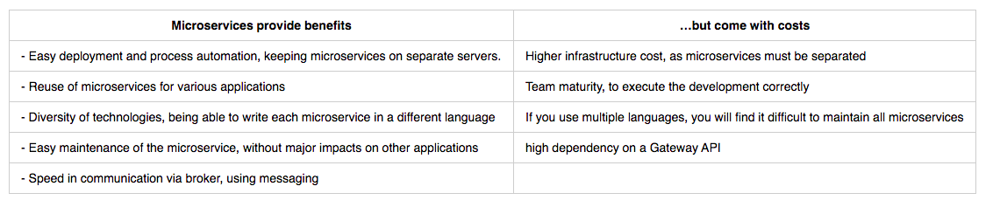

# microservice-style-guide

## Introduction

In short, the microservice architectural style is an approach to developing a single application as a suite of small services, each running in its own process and communicating with lightweight mechanisms, often an HTTP resource API. These services are built around business capabilities and independently deployable by fully automated deployment machinery. There is a bare minimum of centralized management of these services, which may be written in different programming languages and use different data storage technologies.

-- James Lewis and Martin Fowler (2014)

## Definition of microservices

- Comunicação via broker, entre um ou mais microsserviços
- Gateway API for endpoints, not in the microservice itself
- Decentralized Data Management
- Autonomous and independent structure


## When to use microservices

Microservices provide benefits | …but come with costs 
--- | --- |



## What not to do
Microservices, have a high speed due to efficient communication via broker, even the Gateway communicates in this way, when leaving this structure using HTTP for communication between microservices, it loses speed and ends up falling into the concept of apis rest microservices are not apis rest

# Creating a microservice 

## CoteJS

CoteJs is a very small and simple library that allows us to communicate using TCP between various microservices in a very simple and fast way

[CoteJS](https://github.com/dashersw/cote)
### example

```javascript
const cote = require('cote')
const UserService = new cote.Responder({name:'UserService'})

    UserService.on('user.create',async (req,cb) =>{
       
    })

    UserService.on('user.update',async (req,cb) =>{
      
    })

    UserService.on('user.delete',async (req,cb) =>{
       
    })

    UserService.on('user.list',async (req,cb) =>{
      
    })
```

## Polka Api Gateway
Using the broker concept we have polka a very simple and fast library that can be used to create our gateway very quickly, making calls via broker in our microservices

[PolkaJS](https://github.com/lukeed/polka)

### example
```javascript
const polka = require('polka')
const route = polka()
const broker = require('../util/broker')

route
    .get('/',(req,res) =>{
        broker('user.list', res)
    })
    .post('/',(req,res) =>{
        broker('user.create',res,req.body)
    })
    .put('/',(req,res) =>{
        broker('user.update',res,req.body)
    })
    .delete('/:id',(req,res) =>{
        broker('user.delete',res,req.params)
    })

```

